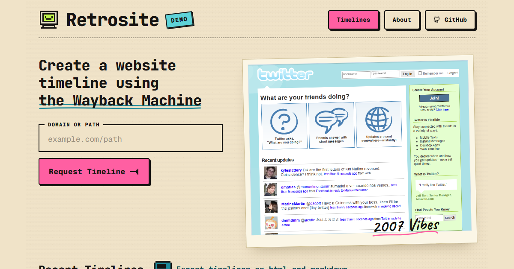

# Retrosite

Retrosite turns public Wayback Machine captures into visual timeline reports.

[Live demo site](https://retrosite.krynsky.com/)

[](https://retrosite.krynsky.com/)

## What It Does

Retrosite has two operating modes:

- The hosted demo at `retrosite.krynsky.com` is a read-only showcase for published website timelines. Visitors can browse timelines and submit requests for future reports.
- The local app is the full report-generation workspace. It discovers Wayback captures, renders screenshots in Chrome, lets you curate entries, edits timeline labels and notes, exports reports, and publishes finished timelines to the demo site.

Current demo timelines are static assets under `krynsky-wayback/timelines/`, so the public site can stay simple and safe while the expensive browser automation runs locally.

## Current Site Updates

- Hosted request-only demo mode with public timeline browsing and timeline request submission.
- Static published timeline pages at `/timeline/:target`.
- All-timelines index at `/timeline`.
- Local report generation from domains or domain/path values.
- Wayback capture discovery across URL variants.
- Playwright screenshot rendering through Chrome.
- Screenshot quality scoring and same-year replacement attempts for weak captures.
- Editable local curation for timeline inclusion, labels, notes, and tech-stack fields.
- Version history view with delete controls for older versions.
- Report deletion controls in local/admin mode.
- Timeline thumbnail selection from any included capture.
- Full screenshot modal opened from a single `View full` control.
- Markdown and HTML export packages with local screenshot assets.
- Static publish workflow for pushing local reports to the demo site.
- Improved tech-stack inference with WordPress and FrontPage versions, readable WordPress theme/plugin labels, and legacy ASP-link handling.

## Routes

- `/` - demo request form and recent published timelines.
- `/about` - hosted demo process overview.
- `/how-to-use` - instructions for running Retrosite locally.
- `/timeline` - published timeline list.
- `/timeline/:target` - generated or published timeline view.
- `/timeline/:target/v/:version` - local generated timeline version view.

## Local Setup

Install dependencies:

```powershell
npm install
```

Run the local dev stack:

```powershell
npm run dev
```

The dev server defaults to:

```text
http://127.0.0.1:5173/
```

The API defaults to:

```text
http://127.0.0.1:4317/
```

Run a production-style local build:

```powershell
npm run build
npm run start
```

## Publishing Timelines

Publish a locally generated timeline into static demo assets:

```powershell
npm run publish:timeline -- <job-id-or-target>
```

The custom Codex skill `retrosite-publish` wraps the full demo-site publish flow: publish static assets, build, push, deploy to Vercel, verify the live timeline, and close the matching GitHub request issue when one exists.

Run request-only mode for a hosted demo:

```powershell
$env:RETROSITE_MODE = "request-only"
npm run start
```

## Verification

```powershell
npm test
npm run check
npm run build
```

## Project Structure

```text
src/
  App.tsx                  React routes and informational pages
  components/              Timeline, report, nav, modal, and admin UI
  helpers.ts               Shared UI/report helpers
  reportCards.ts           Report summary conversion
  styles.css               Site styling
server/
  index.mjs                API, pipeline, exports, persistence, curation
  techstack.mjs            Deterministic tech-stack inference
  worker.mjs               External worker entrypoint
  *.test.mjs               Node test suite
docs/
  MVP_RUNBOOK.md           Operations and hosting notes
  BACKLOG.md               Remaining work
  PACKAGING.md             Local, Pinokio, and Vercel packaging notes
krynsky-wayback/
  og-image.png             Demo-site Open Graph screenshot
  screenshots/             Original hand-curated report assets
  timelines/               Published static generated timelines
```

## Generated Data

Generated jobs and screenshots are written under:

```text
server/generated/
```

That folder is ignored by git. For hosted generation, move it to a durable volume or replace it with database/object storage.

## Known Gaps

- The hosted demo does not run generation or editing directly.
- Generated entry titles can still benefit from manual curation.
- There is no hosted multi-user account model.
- Email notifications and durable hosted queues are not productionized yet.

See `docs/BACKLOG.md` for the current backlog.
